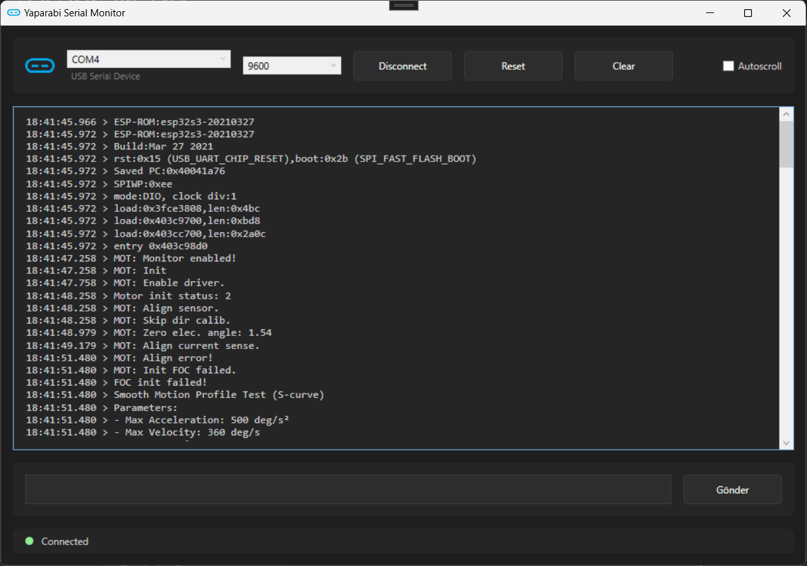

# Yaparabi Serial Monitor
A simple and modern Serial Port Monitor for Windows. Perfect for debugging Arduino, ESP32, and other serial devices.

## Features
- 🔌 Easy connection to serial devices
- 🔍 Auto-detection of ESP32 and Arduino boards
- 📊 Clean, dark-themed interface
- ⚡ Auto-scroll functionality
- 💾 Copy & paste support
- 🔄 Device reset button
- 🧹 Clear terminal option

## Releases
- [v1.0.0](https://github.com/fahreddinaykut/YaparabiSerialMonitor/releases/tag/v1.0.0) - Initial Release
  - Basic serial port monitoring
  - Auto-detection of devices
  - Dark theme interface

## How to Use
1. **Download & Install**
   - Download the latest zip from [Releases](https://github.com/fahreddinaykut/YaparabiSerialMonitor/releases)
   - Extract the zip file
   - Run setup.exe

2. **Connect Your Device**
   - Plug in your Arduino/ESP32 or other serial device
   - Select the correct port from the dropdown menu
   - Choose the appropriate baud rate
   - Click "Connect"

3. **Monitor Serial Data**
   - Your device's output will appear in the main window
   - Use auto-scroll to follow new data
   - Use the clear button to clean the terminal
   - Disable auto-scroll to copy text

## Common Baud Rates
- Other common rates: 300, 1200, 2400, 4800, 9600, 115200, 19200, 38400, 57600

## Troubleshooting
- **Can't see your device?** 
  - Unplug and replug your device
  - Check if drivers are installed
  - Try a different USB port

- **No data showing?**
  - Verify the baud rate matches your device
  - Make sure the correct port is selected
  - Check your device's code is actually sending data
## Download
[Download Yaparabi Serial Monitor ](https://github.com/fahreddinaykut/YaparabiSerialMonitor/releases/download/v1.0.0/YaparabiSerialMonitorSetup.zip)

## License
Free to use for personal and commercial purposes.
